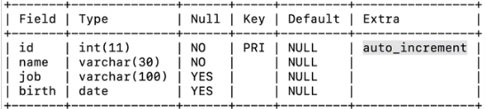

# 241129 공부

## MySQL 날짜 / 시간 타입
1) DATE
- 날짜만
- YYYY-MM-DD
2) DATETIME
- 날짜 + 시간
- YYYY-MM-DD HH:MM:SS
3) TIME
- 시간
- HH:MM:SS
4) **TIMESTAMP : 자동 입력**
- 날짜 + 시간
- YYYY-MM-DD HH:MM:SS

## 제약 조건
- SQL에서 데이터의 무결성과 일관성을 유지하기 위해 설정하는 규칙이다.
- 제약 조건의 종류
1) NOT NULL : 특정 열에 NULL 값 허용하지 않음
2) UNIQUE : 특정 열의값이 중복되지 않도록 보장
3) PRIMARY KEY : 행을 고유하게 식별할수 있는 열을 기본키로 설정함
4) FOREIGN KEY : 한 테이블의 열이 다른 테이블의 기본키를 참조하도록 설정함
5) CHECK : 특정 조건을 만족해야 데이터가 저장되도록 설정함
6) DEFAULT : 열에 데이터가 입력되지 않을 경우의 기본값을 미리 설정함
7) AUTO_INCREMENT : 특정 열의 값을 자동으로 증가시킴. 데이터가 추가될 때마다 이전 값보다 1씩 증가하고, 기본 값은 1.
- 이 외에도 여러 개가 존재한다.

## JOIN
- 두 개 이상의 테이블을 연결하거나 결합하여 데이터를 조회한다. 보통 테이블 간의 공통 열(보통은 FOREIGN KEY)를 기준으로 결합한다.
- JOIN의 종류

1) INNER JOIN : 두 테이블에서 일치하는 행만 반환한다.
```
예제 코드

SELECT columns
FROM table1
INNER JOIN table2
ON table1.common_column = table2.common_column;
```
2) LEFT JOIN : 첫 번째 테이블의 모든 행과, 일치하는 두 번째 테이블의 데이터를 반환. 일치하지 않는 경우 NULL 반환.
```
예제 코드

SELECT columns
FROM table1
LEFT JOIN table2
ON table1.common_column = table2.common_column;
```
3) RIGHT JOIN : 두 번째 테이블의 모든 행과, 일치하는 첫 번째 테이블의 데이터를 반환. 일치하지 않는 경우 NULL 반환.
```
예제 코드

SELECT columns
FROM table1
RIGHT JOIN table2
ON table1.common_column = table2.common_column;
```
4) FULL JOIN : 두 테이블의 모든 행 반환, 한 쪽만 데이터가 있는 경우 NULL 반환.
```
예제 코드

SELECT columns
FROM table1
FULL OUTER JOIN table2
ON table1.common_column = table2.common_column;
```

5) CROSS JOIN : 두 테이블의모든 행의 조합(카티션 곱)을 반환.
```
예제 코드

SELECT columns
FROM table1
CROSS JOIN table2;
```

6) SELF JOIN : 같은 테이블에서 데이터를 조인. 직원 테이블에서 직원 이름과 그 직원을 관리하는 매니저를 찾는 등 같은 테이블에서 조건에 맞는 값을 찾을 때 사용.
```
예제 코드

SELECT a.column_name, b.column_name
FROM table_name a, table_name b
WHERE a.common_column = b.common_column;
```

## 유튜브 DB 제작 실습
1) "Board" 스키마 생성
- 명령어는 대문자로 작성하기!
```
CREATE DATABASE Board;
USE Board;
```

2) 사용자 테이블 생성
- 테이블 이름은 기본적으로 **복수형**
- NOT NULL : 테이블에서 값이 비어있으면 안 됨.
- AUTO_INCREMENT : 값이 자동으로 증가해서 삽입됨.
- PRIMARY KEY (id) : id를 기본키로 사용함.
- DESC users; : users라는 테이블의 **구조**를 확인하는 데 사용되는 명령어이다.

```
CREATE TABLE users (
    id INT NOT NULL AUTO_INCREMENT,
    name VARCHAR(30) NOT NULL,
    job VARCHAR(100),
    birth DATA,
    PRIMARY KEY (id)
);
```

3) 사용자 데이터 삽입
```
INSERT INTO users (name, job, birth)
VALUES("gongu", "actor", "800123");
```

4) 게시글 테이블 생성
- TIMESTAMP는 SQL에서 날짜와 시간을 저장하는 데 사용되는 데이터 타입이다. 보통 특정시간의 타임스탬프를 저장하며, YYYY-MM-DD HH:MM:SS 형식으로 표현한다.
- 현재 시간을 타임스탬프로 찍는 방법은 NOW()와 CURRENT_TIMESTAMP가 있다.

```
CREATE TABLE posts (
    id INT NOT NULL AUTO_INCREMENT,
    title VARCHAR(100) NOT NULL,
    content VARCHAR(2000),
    created_at TIMESTAMP DEFAULT NOW()
    PRIMARY KEY (id)
);
```

5) 게시글 데이터 삽입
```
INSERT INTO posts (title, content)
VALUES ("title1", "content1");
```

6) 게시글에 수정 일자 추가
- ALTER문 : 데이터베이스의 테이블의 구조(스키마)를 변경하는 데 사용된다.
- 주요 사용 사례
```
ALTER TABLE table
ADD column_name data_type [제약 조건]
```
- 사용 예시
```
ALTER TABLE posts
ADD COLUMN updated at DATETIME
DEFAULT NOW() ON UPDATE NOW()
```

7) 게시글 테이블 id = 2인 값 수정
```
UPDATE posts
SET content = "updated!"
WHERE id = 2
```

8) 게시글 테이블에 작성자 컬럼 FK 추가
```
ALTER TABLE posts
ADD FOREIGN KEY (user_id)
REFERENCES users(id);
```