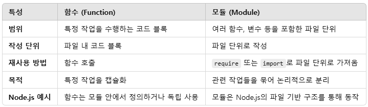

# 241203 강의 요약

## 유효성 검사(validation)
- "사용자가 입력한 값" 유효성(=타당성)을 확인하는 것
- 예시 : userId - 값이 있어야 함, 숫자 / name : 숫자 X, 문자열, 2자 이상 ...
- 외부 모듈 "express-validator" 이용하여 검사

## Node.js에서 유효성 검사 하는 방법
```
const { body, validationResult } = require('express-validator') // 을 통해 express-validator 모듈을 불러와 body 변수에 담기

app.js('/', [body('email').isEmail().withMessage('Invalid email')]. (req, res) => { // email값이 email 형식이 아니면 email 형식이 아니라는 메시지를 저장한다.
    const err = err.array()
    if(!err.isEmpty()) {
        return res.status(404).json(err.array())
    }
} )
```

## 함수와 모듈의 차이
- 함수는 특정 작업을 사용하는 **코드 블록**이다.
- 모듈은 **파일 단위**로 구성된 코드 묶음이다.
