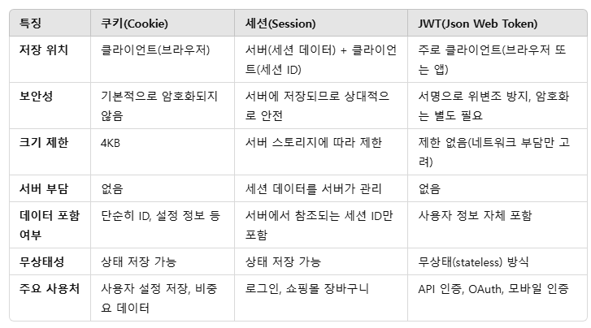

# 241204 강의 요약

## 미들웨어란?
- 클라이언트 요청(Request)과 서버 응답(Resposne) 사이에서 특정 작업을 수행하는 함수이다.

## next()
- 미들웨어 함수 간의 흐름을 관리하기 위한 함수이다. 한 미들웨어가 작업을 완료하면, next()를 호출하여 다음 미들웨어로 응답 객체를 전달한다.

## 인증과 인가
- 인증(= 로그인) : Authentication, **사용자의 신원을 확인하는 과정**이다.
- 인가 : Authorization, **이미 인증이 된 상태에서, 사용자가 특정 작업을 수행할 권한이 있는 지 확인**하는 과정이다.


## 쿠키, 세션
### 쿠키
- 사용자의 **클라이언트**에 저장되는 데이터 조각. 사용자의 상태를 **클라이언트**에 저장한다.
- express.js에서는 cookie 라이브러리 말고 express.js와 통합되어서 사용되는 라이브러리인 cookie.parser를 사용해주어야함.
### 세션
- **서버**에 저장되는 사용자 상태 정보이다.

## JWT(JSON Web Token)
- **JSON 형식으로 인코딩된 데이터와 서명으로 구성된 토큰**으로 **클라이언트와 서버 간의 인증**에 사용된다.
- 보안에 강하고, HTTP 특징을 잘 따른다.
### JWT 구조
- JWT는 Header, Payload, Signature를 점으로 연결한 문자열이다.
- Header : 토큰을 암호화하는 데 사용한 알고리즘(alg), 토큰의 타입(typ)를 담아서 보낸다.
- Payload : 사용자의 데이터를 담아서 보낸다.
- Signature(서명) : JWT의 위변조를 방지하는 데 사용, Header와 Payload를 특정 알고리즘으로 서명하여 생성

## JWT의 인증-인가 절차
1) 로그인 요청
- 클라이언트는 서버에 로그인 요청을 보낸다. 이때 username과 password를 HTTP body에 포함시킨다.
2) 서버의 인증 처리
- 서버는 내부 로직을 통해 클라이언트가 보낸 username과 password를 확인한다.
3) JWT 발급
- 인증에 성공하면 클라이언트가 요청을 보낼 때 사용할 JWT를 발급한다.
- JWT는 Header와 Payload를결합하고, 서버의 비밀 키로 서명하여 위조를 방지한다.
4) 다른 요청 시 JWT 전달
- 클라이언트는 이후 서버와의 모든 요청에서 JWT를 HTTP 헤더에 포함시켜 보낸다.
5) 서버에서 JWT 검증
- 서버는 클라이언트가 보낸 요청을 처리하기 전에 JWT 검증을 진행한다.
6) 요청 처리 및 응답
- 서버가 JWT 검증에 성공하면, 요청된 작업을 수행하고 클라이언트에 응답한다.

## JWT 사용 방법
- JWT 설치
```
npm install jsonwebtoken
```
- JWT 불러오기
```
var jwt = require('jsonwebtoken');

var token = jwt.sign({foo : 'bar'}, process.env.PRIVATE_KEY); // process.env.PRIVATE_KEY는 env 파일 안에 저장된 PRIVATE_KEY 값
var decoded = jwt.verify(token, process.env.PRIVATE_KEY);
```

## .env
- .env 파일은 Node.js 어플리케이션에서 환경 변수를 저장하는 데 사용된다. 민감한 정보를 직접 하드코딩하지 않고 외부에 저장하여 관리하기 위해 사용된다.
- .env 설치
```
npm install dotenv
```
- .env 값 입력 형식
```
PRIVATE_KEY='hihi'
```
- .env 불러오기
```
var dotenv = require('dotenv');

dotenv.config(); // dotenv 사용하겠다고 선언
```
## express.js에서 쿠키 보내기
```
res.cookie("token", token, {
    httpOnly: true, // JavaScripts로 쿠키 접근 방지
    secure: true, // HTTPS에서만 쿠키 전송
    maxAge: 60 * 60 * 1000, // 쿠키 유효 시간
});
```

# JWT 구조 및 인증 절차
## JWT의 구조
- JWT는 세 부분으로 구성된 문자열로, .(점)을 통해 구분된다.
- header.payload.signature
### 1. Header
- 주로 토큰 타입과 서명 알고리즘의 정보를 담고 있다.
```
{
  "alg": "HS256",
  "typ": "JWT"
}
```
### 2. Payload
- 사용자 정보와 클레임을 담는 부분이다. 클레임은 정보의 한 조각을 클레임이라 부르고, 토큰에는 여러개의 클레임을 넣을 수 있다.
- 클레임은 등록된 클레임, 공개 클레임, 비공개 클레임으로 나뉜다.
- 등록된 클레임의 대표적인 예 : iss(토큰 발급자), sub(토큰 제목), aud(토큰 대상자), exp(토큰의 만료 시간) ...
- 공개 클레임 : 
- 비공개 클레임

### 3. Signature
- 위변조 방지를 위해 Header와 Payload를 조합한 후, 서버의 비밀 키로 서명한 값이다.

## 인증 절차
- 로그인을 할 시, 서버가 JWT를 생성해서 클라이언트에 전달한다.
- 서버는 **쿠키**에 JWT를 담아서 클라이언트에 전달한다.
- 클라이언트는 JWT를 Header에 포함해서 요청값을 전달한다.
- 서버는 JWT를 검증하고 요청을 처리한다.
- 토큰의 만료 시간이 지나면, 서버는 요청을 거부한다.
- 만료된 액세스 토큰을 갱신하기 위해 별도의 리프레시 토큰을 사용한다.

## 보안의 주의점
- 민감한 데이터는 Payload에 포함해서는 안된다.
- HTTPS 사용으로 네트워크에서 토큰을 탈취하는 것을 방지한다.
- 짧은 만료 시간과 리프레시 토큰을 사용하여 보안을 강화한다.