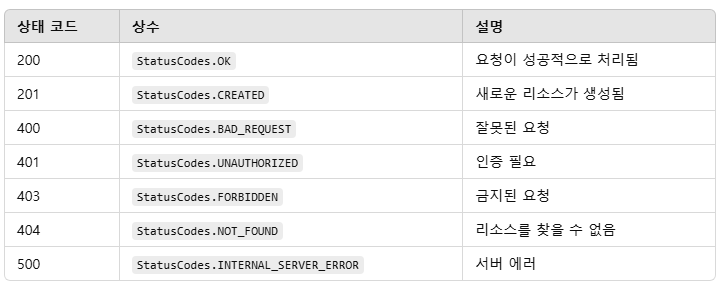

# 241211 강의 요약

## http-status-codes
- Node.js에서 HTTP 상태 코드를 쉽게 관리하고 사용할 수 있도록 제공하는 라이브러리.
- 주요 기능
1) HTTP 상태 코드 숫자와 이름 사용
2) 가독성 향상
- 사용 방법
```
const express = require('express');
const { StatusCodes } = require('http-status-codes');
const app = express();
app.listen(3000);

const { StatusCodes } = require('http-status-codes');

app.get('/', (req, res) => {
  res.status(StatusCodes.OK).send("Hello, world!"); // 200
});

app.use((req, res) => {
  res.status(StatusCodes.NOT_FOUND).send("Page not found");
});
```
- 주요 상태 코드


## 컨트롤러
- 컨트롤러는 보통 MVC 디자인 패턴에서 컨트롤러 역할을 수행하는 코드. 컨트롤러는 사용자의 요청을 받아 처리하고, 필요한 데이터를 모델에서 가져오거나 갱신하며, 그 결과를 뷰에 전달하는 역할을 함.

## 비밀번호 암호화
```
const crypto = require('crypto');

const salt = crypto.randomBytes(64).toString('base64');
const hashPassword = crypto.pbkdf2Sync(password, salt, 10000, 64, 'sha512').toString('base64');
```